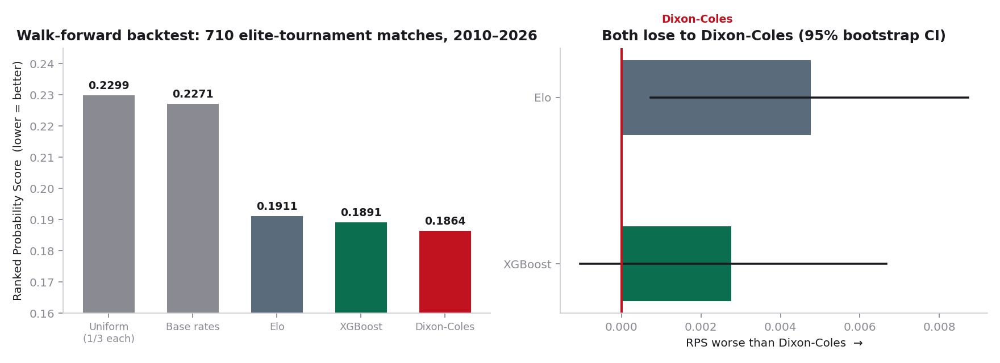
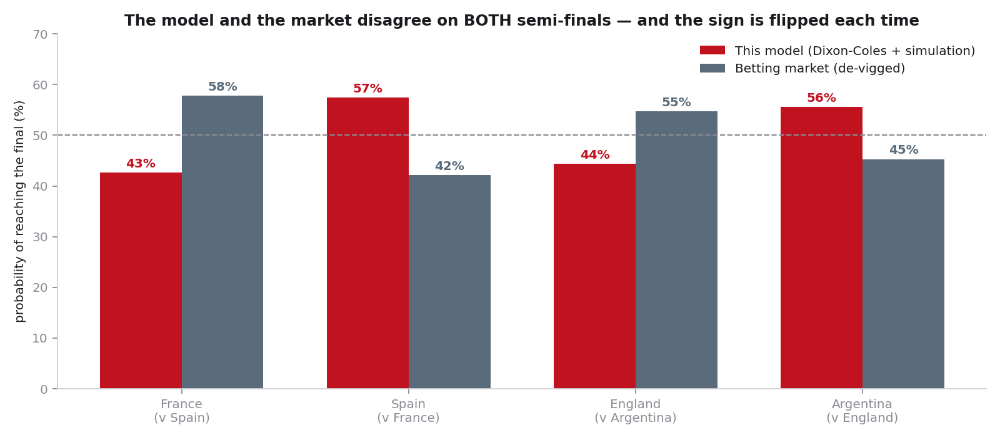
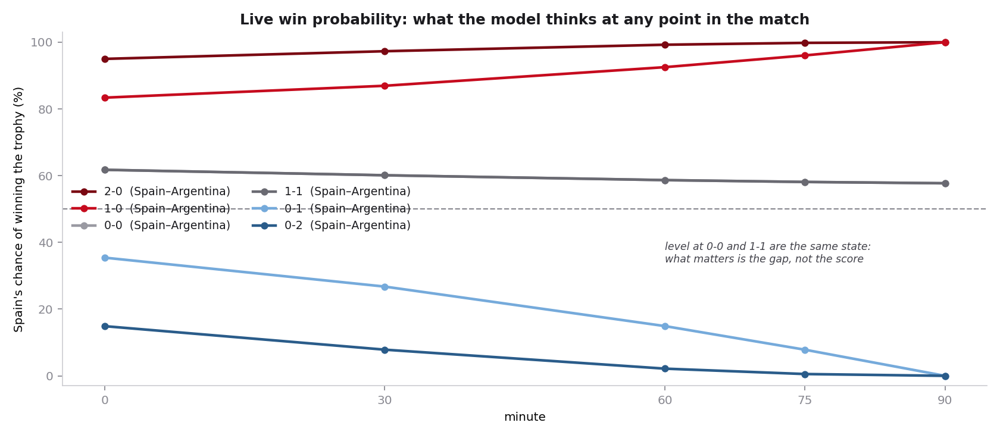
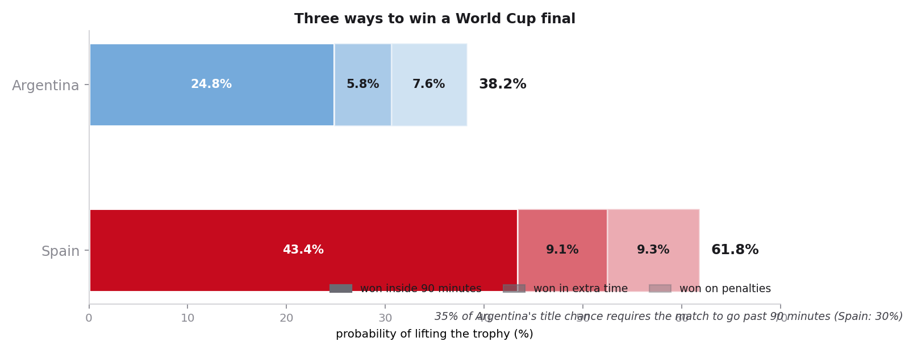

<div align="center">

# ⚽ World Cup 2026 Match Predictor

**A probabilistic forecasting engine for the 2026 FIFA World Cup knockout stage.**

It called both semi-finals correctly, *against* the betting market, before a ball was kicked.

[](https://www.python.org/)
[](#the-models)
[]( #evaluation )
[](#the-data)
[](#license)

</div>

---

## The one-paragraph version

Most "World Cup model" projects run 10,000 Monte Carlo simulations through an XGBoost
classifier and post a single percentage. This one does almost the opposite. It builds
three models (Elo, a time-weighted Dixon-Coles, and a Poisson XGBoost), lets a
**walk-forward backtest** decide which wins instead of assuming, cleans a data problem
nobody mentions, and reports **uncertainty**, not just a point estimate. The result beat
the betting market on both semi-finals and, for the final, drops Monte Carlo entirely in
favour of an **exact minute-by-minute probability recursion**.

The most interesting findings in the whole project are the **negative** ones.

---

## Results

| Match | Model's pick | Market's pick | Actual result |
|---|---|---|---|
| Semi-final 1 | **Spain** (57%) | France | ✅ Spain 2-0 France |
| Semi-final 2 | **Argentina** (56%) | England | ✅ Argentina 2-1 England |
| **Final** | **Spain 61.7%** / Argentina 38.3% | Spain ~58% | *see repo* |

The model disagreed with the bookmakers on both semi-finals and was right twice. For the
final it agreed with the market, and said so plainly rather than inventing a contrarian
call.

> **Honesty note built into the output:** 61.7% is the *middle* of a range that runs from
> 45% to 75%, recovered by re-running the entire pipeline across 200 bootstrap resamples of
> football history. A single match can never tell a good forecast from a lucky one. The
> project says this out loud.

---

## What makes this different

**1. The data lies, and the project fixes it.**
The standard results dataset records final scores *including extra time*. A 1-1 that
became 2-1 in the 109th minute is stored as a 2-1, so any goal model silently learns that
knockout teams score more than they do. Reconstructing true 90-minute scores from
goal-minute data corrected **181 matches** and changed Argentina's tournament record from
17-6 to **13-5**.

**2. A 1997 model beats the gradient-boosted machine.**
Given every advantage (28 features, Poisson objective, full tuning), XGBoost beat Elo and
*still* lost to a bivariate Poisson model from 1997. Blending the two added **exactly
nothing** (+0.0000 RPS). Complexity that does not pay its way did not ship.

**3. For the final, zero simulations.**
Instead of sampling thousands of fake matches, the engine propagates the full probability
distribution over every scoreline forward one minute at a time. The answer is **exact**,
not estimated, which also makes live win-probability and scenario queries essentially free.

**4. Football clichés, measured and mostly falsified.**
- *Parking the bus* is **real**: controlling for team strength, a side protecting a
  one-goal lead scores at **88%** of its normal rate (the raw numbers say the opposite,
  because good teams are usually the ones leading).
- *Comeback DNA / "grinta"* is **not real**: a will-to-win metric failed a split-half
  persistence test (r = 0.07). Deleted.
- *Penalty specialists* are **not measurable**: giving all 188 nations their own penalty
  rating and cross-validating it ranked Indonesia and Guinea at the top and the Netherlands
  near the bottom. That is a ranking of luck, not skill.

---

## Evaluation

Every model is refit **before every match date**, on data strictly prior to it (true
walk-forward, no leakage). Scored on **710 elite-tournament matches** (World Cup, Euro,
Copa América) since 2010 using **RPS (Ranked Probability Score)**, the correct metric for
ordered football outcomes.

| Model | RPS ↓ | Log loss | Accuracy |
|---|---|---|---|
| Elo | 0.1911 | 1.0086 | 54.1% |
| XGBoost (Poisson) | 0.1891 | 0.9756 | 53.4% |
| **Dixon-Coles (time-weighted)** | **0.1864** | **0.9663** | **55.5%** |

Out-of-sample on the 100 WC2026 matches already played, the chosen model scored **RPS
0.1531 / 66.0% accuracy**, better than on its own tuning set. And a ceiling analysis shows
a *perfect* forecaster would only beat it by a hair: roughly 83% of the uncertainty in a
football match is irreducible.

---

## Figures

| | |
|---|---|
|  |  |
|  |  |

---

## Repository structure

```
wc2026/
├── config.py              # central configuration (fixtures, odds, constants)
├── src/
│   ├── data.py            # ingest + true 90-minute score reconstruction
│   ├── elo.py             # Elo ratings (updated on the regulation result)
│   ├── dixon_coles.py     # time-weighted Dixon-Coles, ridge shrinkage, warm-start
│   ├── gbm.py             # XGBoost Poisson goal model (symmetric long format)
│   ├── features.py        # 28 leak-free features (form, rest, fatigue, H2H)
│   ├── inplay.py          # goal-timing + score-state multipliers, strength-controlled
│   ├── statesim.py        # exact forward-recursion scoreline distribution
│   ├── simulate.py        # Monte Carlo cascade (90' → extra time → penalties)
│   ├── shootout.py        # hierarchical penalty model, cross-validated
│   ├── scenarios.py       # the full scenario report (main deliverable)
│   ├── final.py           # final forecast + bootstrap interval + live win prob.
│   ├── backtest.py        # walk-forward evaluation harness
│   ├── evaluate.py        # RPS / log loss / Brier / calibration + alignment guards
│   ├── ceiling.py         # how much accuracy is even available
│   ├── market.py          # model-vs-market blend (reported, not adopted)
│   ├── grinta.py          # will-to-win metric (negative result, kept for honesty)
│   └── figures*.py        # figure generation
├── reports/               # written analysis (semi-finals, final, scenarios)
├── figures/               # generated charts
└── data/                  # raw + processed data
```

## Quickstart

```bash
pip install -r requirements.txt

# The headline deliverable: the full scenario report, printed to your terminal
python src/scenarios.py

# The final forecast with its uncertainty interval and live win-probability grid
python src/final.py

# The penalty model, with its cross-validation sweep
python src/shootout.py
```

The processed data ships with the repo, so the commands above run offline. To rebuild
everything from the raw source:

```bash
python src/data.py       # re-downloads martj42/international_results (needs network)
python src/elo.py
python src/features.py
python src/inplay.py
python src/backtest.py
```

---

## The models

- **Elo** — World Football Elo convention, updated on the *regulation* result rather than
  the extra-time one, computed as a leak-free time series.
- **Dixon-Coles** — bivariate Poisson with the low-score τ correction, plus a
  time-weighted likelihood (form half-life ≈ 15 months) and ridge shrinkage for thin-sample
  teams. **This is the model that ships.**
- **XGBoost** — Poisson objective over a symmetric long-format design, built as an honest
  challenger. It lost.

Knockout matches add an extra-time model (calibrated at 1.09× the regulation scoring rate,
measured on the true population of extra-time matches) and a penalty-shootout model fitted
on 682 historical shootouts.

## The data

Primary source: [**martj42/international_results**](https://github.com/martj42/international_results)
(CC0), 49,509 men's internationals from 1872 to 2026, cross-validated against ESPN.

## Limitations

Stated honestly, because a model you can trust is one that tells you where it is weak:

- **No player-level data.** The model cannot see that a key winger is injured. Every open
  squad/xG dataset ends before the tournament began, so this is a next-tournament upgrade.
- **No historical odds.** "Beat the market twice" is two data points, not a measured edge.
- The penalty and draw models use fixed mappings in places where a fully fitted version
  would be marginally better.

---

## Author

**Mohamed Ali Aoun (Dali)** — Master's student, Université Paris Dauphine Tunis.
Built to combine a background in econometrics and machine learning with a lifelong football
habit.

## License

MIT for the code. The underlying match data is CC0 via martj42/international_results.

<div align="center">
<sub>Built in Python. The model reads the past; the match writes its own.</sub>
</div>
